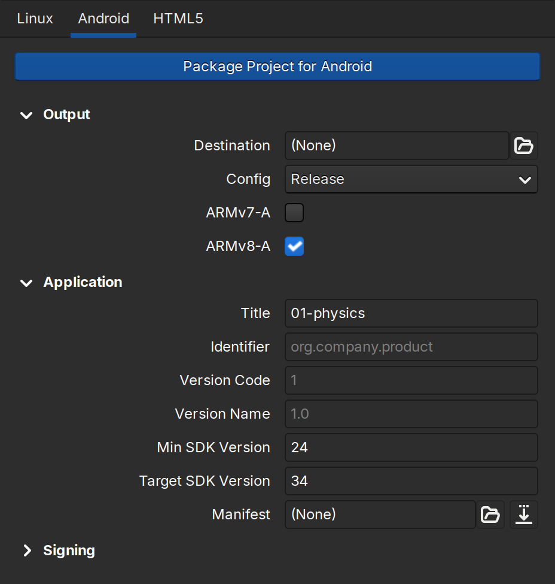
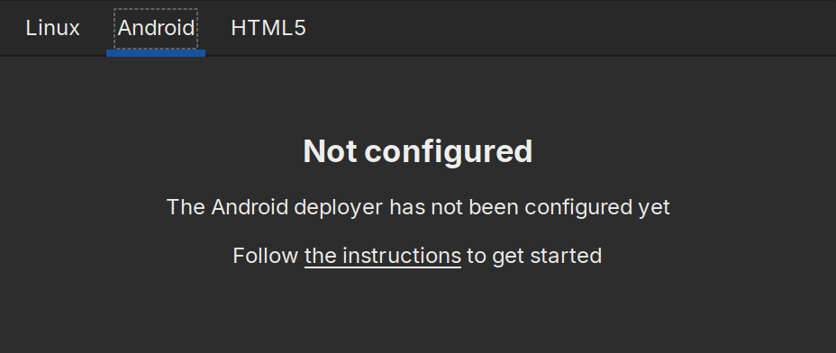
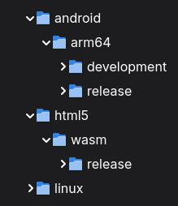
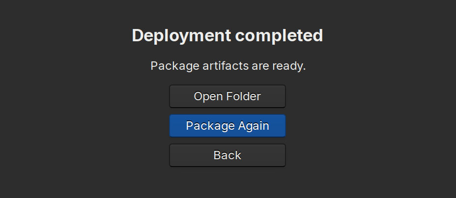

Deploying
=========

Use the integrated deployer to generate final packages ready to be distributed
to end-users. Click ``File`` -> ``Deploy`` to open the Deploy Dialog:

   The Deploy dialog for Android.

Configure the target platform
-----------------------------

Navigate to the desired target platform using the tabs at the top. When
deploying to a platform that differs from the host platform, you will first be
asked to configure the deployer:

   Unconfigured Android deployer.

Follow the instructions to configure the deployer for your target platform:

    * :ref:`Android <Configure Android deployer>`
    * :ref:`HTML5 <Configure HTML5 deployer>`

After the configuration in done, restart the editor and navigate back to the
Deployer Dialog to proceed.

Output destination and Config
-----------------------------

Select the destination folder where the output will be stored. Next, select the
desired configuration. You can choose between the ``Release`` or ``Development``
configurations.

A project deployed in ``Release`` mode is stripped of unnecessary components and
optimized for maximum performance. The ``Development`` configuration includes
debugging symbols and other features useful during development.

   Destination folder can host multiple platforms and configs.

You can deploy multiple platforms, arhitectures and configurations in the same
destination folder. By default Crown creates packages following this tree
structure:

    ``<destination>``/``<platform>``/``<architecture>``/``<config>``

Package the Project
-------------------

Click the ``Package Project for <platform>`` at the top to begin packaging the
project.

Crown will compile the project and generate a self-contained folder or package
ready to be distributed. At the end of the process you can choose to navigate to
the generated binaries or repeat the packaging.

   A package successfully deployed.
