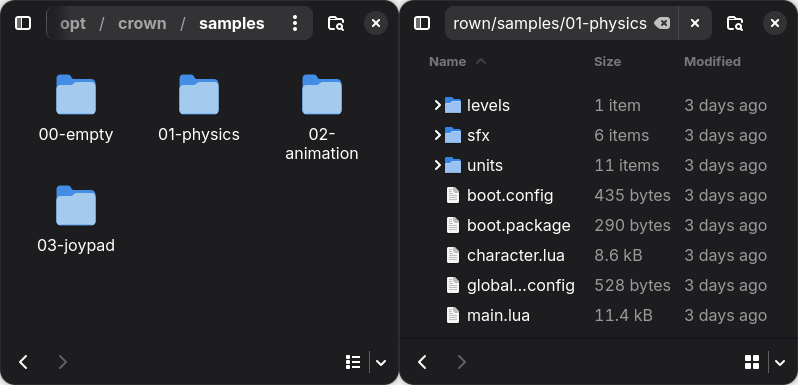
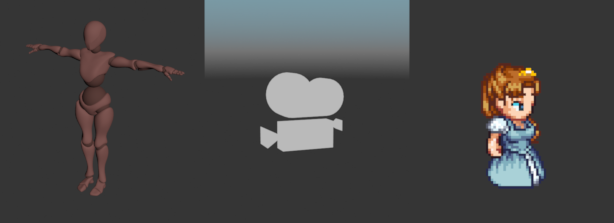

Basic Concepts
==============

This page introduces the fundamental concepts and terminology used when working
with Crown. Reading this section will give you a high-level understanding of the
core pieces in a Crown project. It is strongly recommended to read it carefully
to avoid confusion later.

.. _project:

Project
-------

In Crown, a project is a folder that contains every resource used to describe
your game. These resources are mostly plain-text files, with a few exceptions
for inherently binary resources, such as textures and sounds.

Except for a few special files, resources can be arranged freely within a Crown
project.

   Left: four sample projects. Right: resources in a project folder.

Resource paths and names
------------------------

Resources are identified by their paths relative to the project root, with the
file extension omitted. Crown uses Unix-style paths with forward slashes
(``/``).

For example, the unit at path ``units/player/player.unit`` is identified by name
as ``units/player/player``.

All resource paths must be canonical and normalized, strings such as
``units/../units/player/player`` or ``units\\player\\player`` are invalid
resource names.

Unit and Components
-------------------

Units are the fundamental building blocks in Crown. Units can be used to
represent any object that exists in a game world - a character, a tree, a
vehicle, a light etc.

   Three example units.

By default, units are empty. You add functionality to a Unit by adding
Components to it. No component is mandatory, units can be just empty IDs.

Crown includes a number of predefined components, some examples are:

- ``Transform`` - specifies a position, rotation and scale in the world
- ``MeshRenderer`` - draws a 3D mesh
- ``Actor`` - specifies physics properties for a collider, such as mass, filter etc.
- ``Script`` - adds logic via a Lua script
- ``Light``, ``Camera``, ``Fog``, ``Bloom`` etc.

Components can be added or removed at any time in the editor or at runtime.

Units support parent-child relationships, allowing you to build complex object
hierarchies from smaller units. For example, a car unit might contain separate
units for its body, wheels, and lights.

Unit Prefab
-----------

Saving a unit to disk as a *.unit* resource creates a prefab. Other units can
reference the prefab and inherit its components and hierarchy. Changes to the
prefab are automatically propagated to all of its instances.

You can create unit prefabs by saving existing units in the :ref:`Level Editor
<level_editor>` or, more commonly, by importing them from :ref:`scenes
<importing_scenes>` or :ref:`sprites <importing_sprites>`.

World
-----

A World is the runtime container that holds Units and other objects and
advances the game simulation. When a World is running it:

- updates animations/audio/particles;
- steps physics and handles collisions;
- dispatches logic events to script components;
- renders the visible scene;
- etc.

You can populate a world manually through code or automatically by loading level
resources into it.

A game always has at least one active world. Although uncommon, multiple worlds
can run simultaneously, for example, one for the main game and another for a UI
overlay.

Level
-----

A *.level* resource represents a saved collection of units, sounds, and other
objects.

You create levels in the :ref:`Level Editor <level_editor>`. A world can load
multiple levels simultaneously to form complex, multi-layered scenes.
