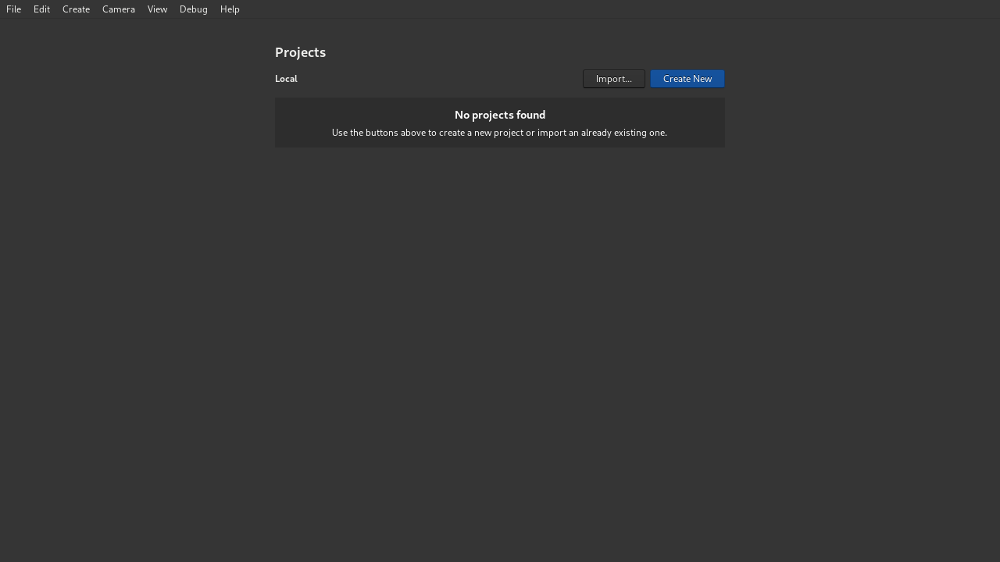
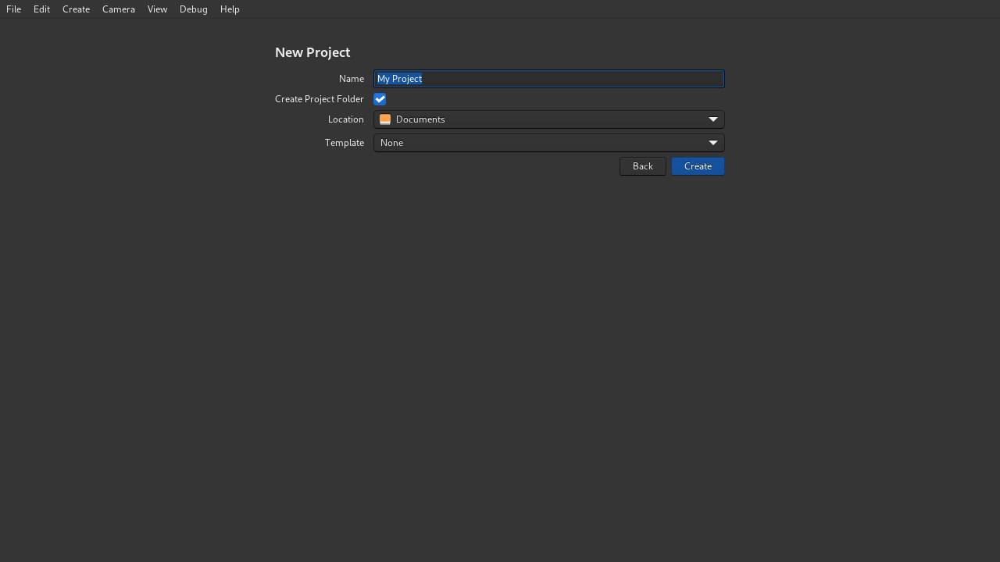
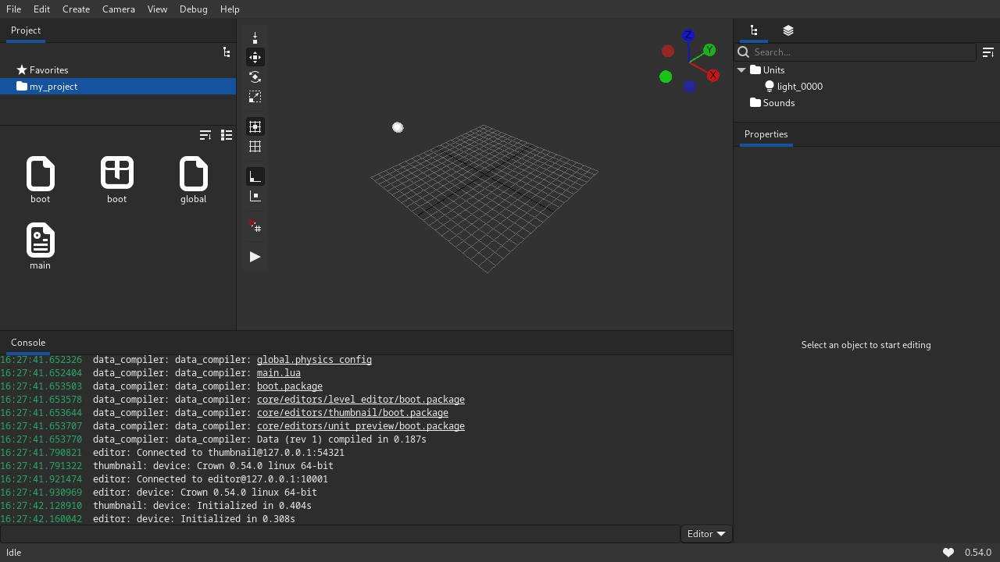

.. _create_new_project:

======================
Creating a new project
======================

After closing a project, or whenever starting the Editor, Crown displays the
Projects List. From here, you can open/manage existing projects or create new
ones:

Click the ``Create New`` button to start creating a New Project:

First, choose a ``Name`` for your project.  If ``Create Project Folder`` is
enabled, Crown will automatically create a project folder in the specified
``Location``, based on the project name. Otherwise, create a new empty folder
yourself, and select it with the ``Location`` button.

Optionally, you can choose a ``Template`` project from a list of installed
templates, or leave it to ``None`` to start with a new empty project.

When you are ready, click ``Create`` button and Crown will create the project
and open it automatically:

