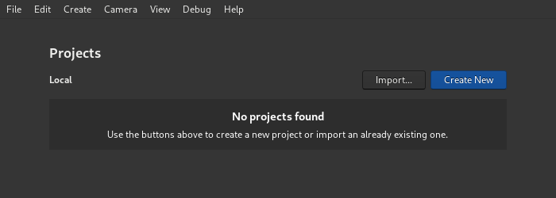
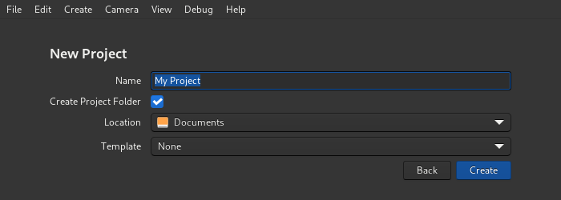
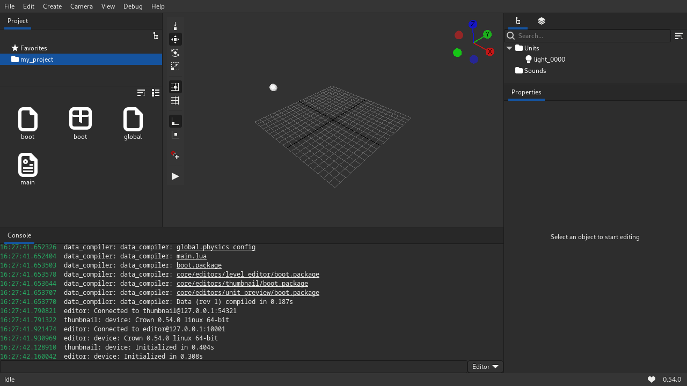

.. _create_new_project:

======================
Creating a new project
======================

When you start the Editor or close a project, Crown displays the Projects List.
From here, you can open and manage existing projects or create new ones:

   The Projects List with no projects yet.

Click the ``Create New`` button to start creating a New Project:

   The New Project dialog.

First, enter a ``Name`` for your project. If ``Create Project Folder`` is
enabled, Crown automatically creates a folder with that name in the specified
``Location``. Otherwise, create an empty folder yourself and select it using the
``Location`` button.

Optionally, you can choose a ``Template`` project from a list of installed
templates, or leave it to ``None`` to start with a new empty project.

When you are ready, click the ``Create`` button. Crown will create and open the
project automatically:

   A newly created project opened in the Editor.
