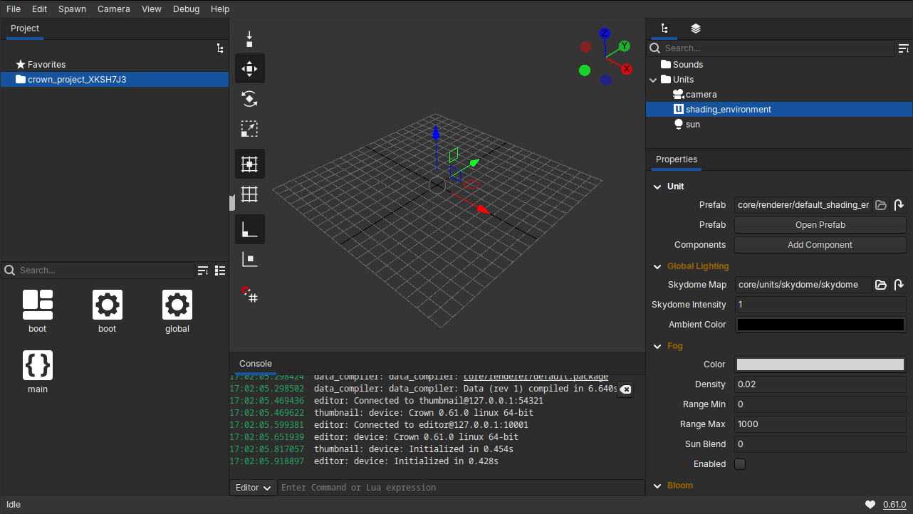
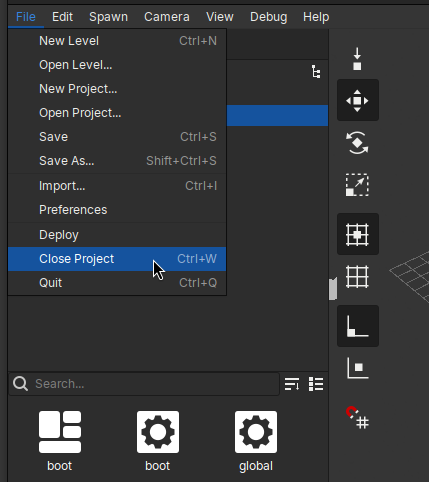
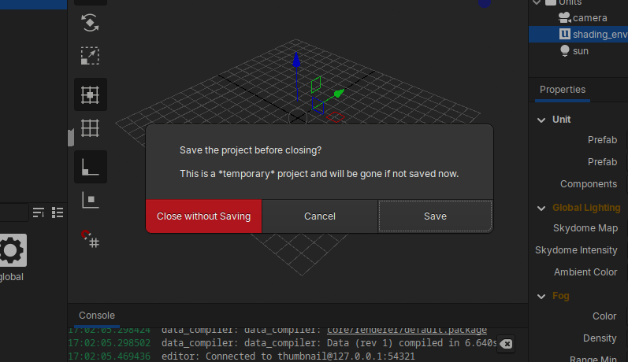

=================
For the Impatient
=================

When you first launch the Crown Editor and no projects exist, Crown
automatically generates a temporary project and opens it. This lets you
explore the editor immediately without any extra steps.

At this point you can either jump straight into the :ref:`level_editor` basics
to get a feel for the editor’s features, or close the temporary project and
create a new one yourself, for example, starting from a featureful template.

To close the temporary project, choose ``File`` -> ``Close Project``:

You will be asked whether to save or discard the temporary project. Choose
``Save`` to keep your work (the project will then appear in the Projects
List), or ``Close without Saving`` to discard it. After closing the temporary
project, Crown opens the Projects List, where you can :ref:`create a new
project <create_new_project>`.

Tip: If you plan to continue working on what you created during this session,
save the temporary project before closing. If you were just experimenting,
discarding it is fine; you can always start a new project from a template
later.
