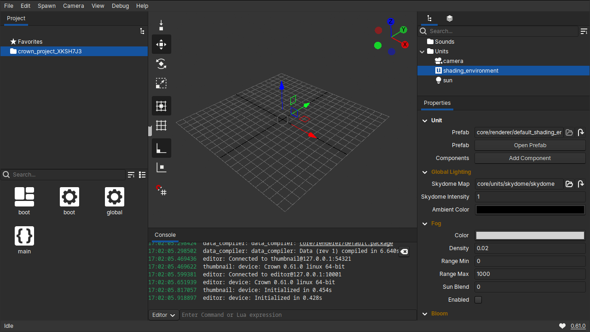
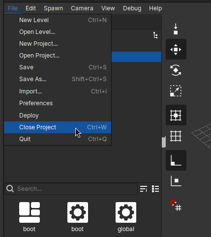
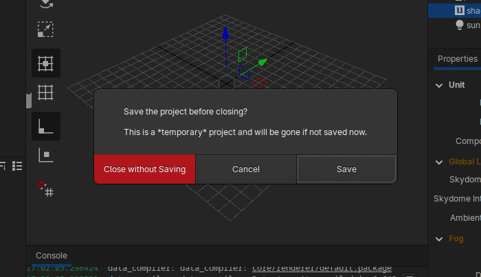

=================
For the Impatient
=================

When you launch the Crown Editor for the first time, Crown automatically creates
and opens a temporary project. This lets you explore the graphical interface
immediately without any additional setup.

   The temporary project created on first launch.

You can now jump straight into the :ref:`level_editor` to explore its features,
or close the temporary project and create your own, optionally starting from a
template.

To close the temporary project, choose ``File`` -> ``Close Project``:

   Closing the temporary project from the File menu.

You will be asked whether to save or discard the temporary project. Choose
``Save`` to keep your work (the project will then appear in the Projects List),
or ``Close without Saving`` to discard it. Closing the temporary project takes
you to the Projects List, where you can :ref:`create a new project
<create_new_project>`.

   Confirmation dialog asking whether to save the temporary project.

Tip: Save the temporary project before closing if you want to continue working
on it. If you were only experimenting, you can safely discard it and start a new
project from a template later.
