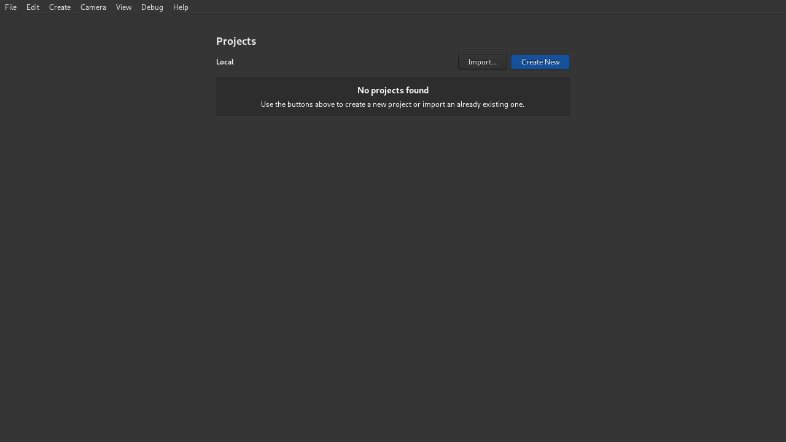
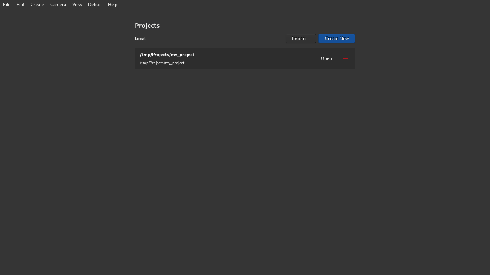

=============================
Importing an existing project
=============================

Crown projects are just regular folders. If you want to import an existing
project, click the ``Import...`` button in the projects list:

   The Projects List with no projects yet.

Then, select the folder containing the project and click the ``Open`` button:

.. figure:: images/import_project_select_folder.png
   :align: center

   Selecting an existing project folder to import.

If the project is correctly recognized, Crown will add it to the projects list:

   An imported project listed in the Projects List.

When you are ready, click the ``Open`` button on the newly imported project to
start working on it.
