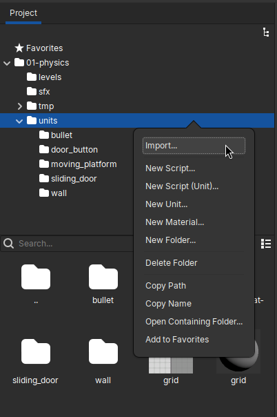
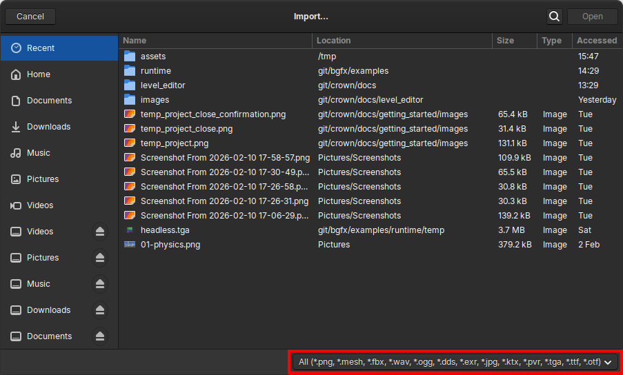
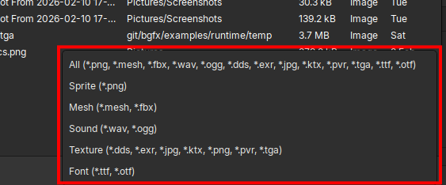

.. _importing_resources:

Importing resources
===================

Importing resources is the process of bringing externally created digital
assets into a Crown :ref:`project <project>`. Imported resources such as
models, textures, sound files etc. are processed by Crown and made available
for use in Levels, Units, and other project content.

Drag-and-drop
-------------

The quickest way to import assets into a Crown project is to drag-and-drop
files from your file manager into the Project Browser. Crown will detect the
resource types automatically and open an appropriate importer dialog so you
can fine-tune import options.

Import via Project Browser
--------------------------

   Importing resources via the Project Browser context menu.

You can also import files from the Project Browser. Navigate to the target
folder, right-click the folder, and choose ``Import...`` from the context
menu. Crown will present a file picker:

   The Import dialog for picking files and choosing the resource type.

This method is useful when you want more control: the Import dialog lets you
choose how Crown should process the selected files. That matters because the
same file extension can sometimes map to different resource types
(for example, ``.png`` files can be imported as textures or as sprites). Use
the resource-type selector to pick the desired resource:

   Selecting the resource type in the Import dialog.

Import via Command Line
-----------------------

When importing from the command line, the editor automatically selects the
appropriate importer based on file extensions. Use ``--as`` to select a specific
importer when an extension supports more than one resource type. For example,
import a PNG as a sprite with:

.. code::

   ./crown-launcher editor --source-dir $CROWN/samples/01-physics --import hero.png units/hero --as sprite

The destination path is relative to the project source directory. See the
:doc:`command line reference <../reference/command_line>` for ``--import``
syntax and the list of supported importer types.
