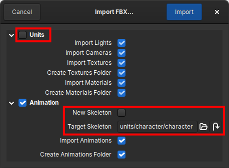
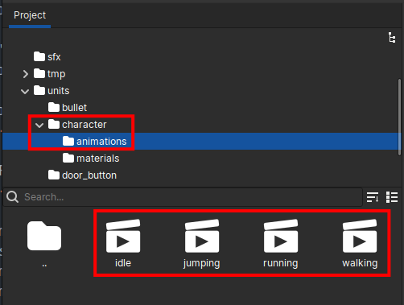

.. _importing_scenes:

Importing Scenes
================

Crown can import most useful elements from 3D scenes saved in FBX format. When
you import an FBX file, Crown opens a dialog where you can select import
options and choose which parts of the scene to bring into your project:

.. figure:: images/import_fbx.png
   :align: center

   The FBX import dialog.

FBX import dialog
-----------------

The FBX import dialog is divided into two main sections:

* Units: import geometry, lights, cameras, materials and any associated
  textures.
* Animation: import skeleton and animation clips. If your scene contains no
  animations, you can ignore this section.

One FBX per clip
----------------

A common workflow for animated 3D models is to export the geometry and
skeleton together in one FBX file, and export each animation clip as a
separate FBX file. Crown supports and recommends this approach because it
simplifies asset management and make faster iterations possible.

To import models organized in this way, always follow these 2 steps:

1) Importing geometry and skeleton
~~~~~~~~~~~~~~~~~~~~~~~~~~~~~~~~~~

Start by importing the FBX that contains the geometry and skeleton. In the
Project Browser create or select the target folder, make sure ``Import
Animations`` is unchecked, then click ``Import`` to begin:

.. figure:: images/import_fbx_unchecked_animations.svg
   :align: center

   Disabling animation import when importing geometry and skeleton.

When the import completes, the unit (geometry), the skeleton, and any other
objects you selected in the Unit section will appear as separate items in the
Project Browser:

.. figure:: images/project_browser_import_clips_unit_and_skeleton.svg
   :align: center

   Imported unit, skeleton, and related resources in the Project Browser.

2) Importing animation clips
~~~~~~~~~~~~~~~~~~~~~~~~~~~~

After importing geometry and skeleton, import the FBX files that contain the
individual animation clips. Right-click the same folder, choose
``Import...``, and select the FBX files with the clips. In the importer
dialog:

* Uncheck the entire **Unit** section to avoid importing any undesired resource.
* Uncheck ``New Skeleton`` to indicate that the skeleton already exists.
* Set ``Target Skeleton`` to the skeleton you imported in the previous step.

   Selecting the target skeleton when importing animation clips.

When the importer finishes, it creates an ``animations`` folder and places the
imported clips inside it, with correct references to the existing skeleton and
geometry:

   Imported animation clips in the dedicated ``animations`` folder.
