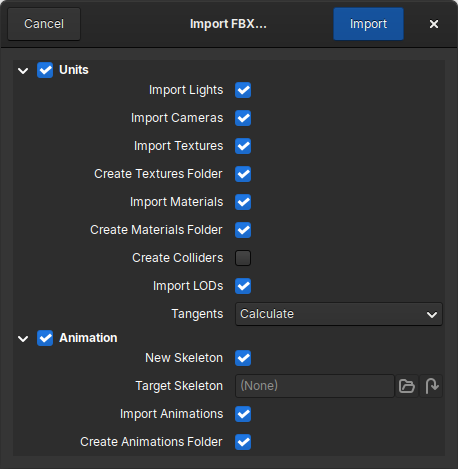
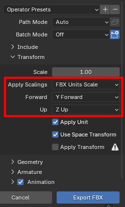
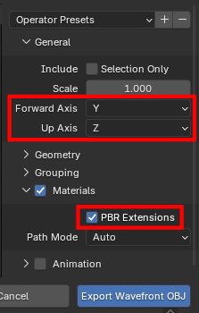
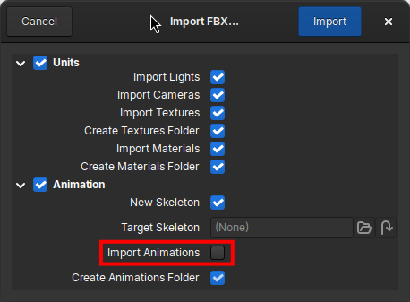
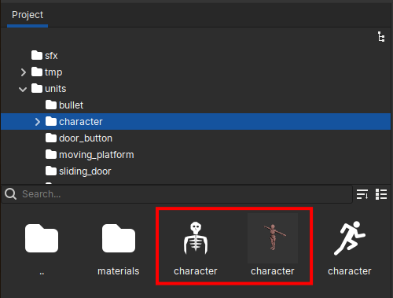
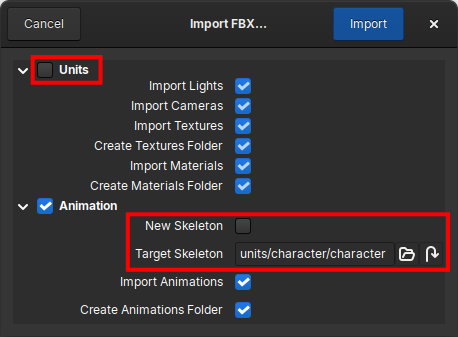
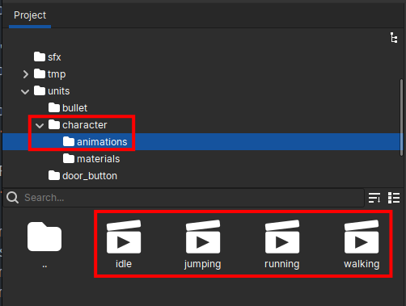

.. _importing_scenes:

Importing Scenes
================

Crown can import most useful elements from 3D scenes saved in FBX or OBJ format.
The sections below refer mostly to FBX models because FBX is the most popular
format, but the same principles apply to other supported formats. Specific
formats are mentioned where necessary.

FBX import dialog
-----------------

When you import an FBX file, Crown opens a dialog where you can select import
options and choose which parts of the scene to bring into the project. The FBX
import dialog is divided into two main sections:

* Units: import geometry, lights, cameras, materials and any associated
  textures.
* Animation: import skeleton and animation clips. If your scene contains no
  animations, you can ignore this section.

   The FBX import dialog.

Preparing Models for Export
---------------------------

Crown uses Y-forward Z-up axes. To keep models correctly oriented after import,
use those axes when exporting from DCC programs whenever possible.

This is especially important when working with OBJ scenes, because the format
generally does not store the axes used at export time. In that case, Crown has
no way to automatically detect whether it should insert an extra root node to
correct the orientation. FBX scenes, on the other hand, include this
information, and Crown uses it to insert a corrective root node when necessary.
Even so, it is best to export with settings that match Crown's conventions.

The settings below are Blender-specific. Other 3D applications may expose the
same export choices under different names. For both FBX and OBJ exports, set
``Forward`` to ``Y`` and ``Up`` to ``Z``.

FBX
~~~

When exporting FBX files, also set ``Apply Scalings`` to ``FBX Units Scale``.
This causes the FBX file to store meter units, which matches Crown's importer
and avoids an extra root unit.

   Blender FBX export settings for axes and unit scaling.

OBJ
~~~

For OBJ exports, enable ``PBR Extensions`` under ``Materials`` when the option
is available; otherwise, some texture maps may go undetected by the importer.

   Blender OBJ export settings for axes and material metadata.

One FBX per clip
----------------

A common workflow for animated 3D models is to export the geometry and
skeleton together in one FBX file, and export each animation clip as a
separate FBX file. Crown supports and recommends this approach because it
simplifies asset management and make faster iterations possible.

To import models organized in this way, always follow these 2 steps:

1) Importing geometry and skeleton
~~~~~~~~~~~~~~~~~~~~~~~~~~~~~~~~~~

Start by importing the FBX that contains the geometry and skeleton. In the
Project Browser create or select the target folder, make sure ``Import
Animations`` is unchecked, then click ``Import`` to begin:

   Disabling animation import when importing geometry and skeleton.

When the import completes, the unit (geometry), the skeleton, and any other
objects you selected in the Unit section will appear as separate items in the
Project Browser:

   Imported unit, skeleton, and related resources in the Project Browser.

2) Importing animation clips
~~~~~~~~~~~~~~~~~~~~~~~~~~~~

After importing geometry and skeleton, import the FBX files that contain the
individual animation clips. Right-click the same folder, choose
``Import...``, and select the FBX files with the clips. In the importer
dialog:

* Uncheck the entire **Unit** section to avoid importing any undesired resource.
* Uncheck ``New Skeleton`` to indicate that the skeleton already exists.
* Set ``Target Skeleton`` to the skeleton you imported in the previous step.

   Selecting the target skeleton when importing animation clips.

When the importer finishes, it creates an ``animations`` folder and places the
imported clips inside it, with correct references to the existing skeleton and
geometry:

   Imported animation clips in the dedicated ``animations`` folder.

