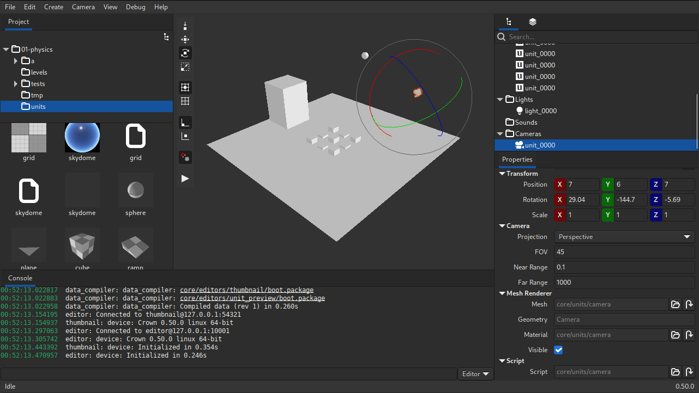

============
Introduction
============

What is it?
-----------

Crown is a complete and cross-platform game engine designed for flexibility,
performance, and fast-iterations. It isn't tied to any specific game type or
genre; instead, it provides versatile tools and general primitives suitable for
building a wide range of 3D and 2D games.

.. note::

    Crown is in active development and new features are added and improved all
    the time; You can follow the development progress in real-time on `GitHub
    <https://github.com/crownengine/crown/issues>`__ and join the discussions on
    the `Discord <https://discord.com/invite/CeXVWCT>`__ channel!

License
-------

The games you create with Crown are your sole property. All the data (models,
textures, levels etc.) and code you produce (including any data and code
generated by Crown) are yours to use as you wish. See :doc:`copyright` for a
comprehensive list of applicable licenses.

Supported platforms
-------------------

* Runtime
	* Android 7.0+ (ARMv7-a, ARMv8-a)
	* HTML5 (Wasm/Emscripten)
	* Ubuntu 22.04+ (x86_64)
	* Windows 10+ (x86_64)

* Editor
	* Ubuntu 22.04+ (or any 64-bit Linux with GTK+ >= 3.24)
	* Windows 10+

Design Principles
-----------------

Crown is loosely inspired by the Bitsquid engine and shares with it many of its
design principles:

* Data-driven
	All aspects of the game are defined via text-based configuration files,
	which are compiled into native, efficient, platform-specific BLOBs before
	shipping. These files are human-readable, making them easy to inspect and
	compatible with traditional VCS and regular text-based utilities.

* Data-oriented
	Data in memory is organized to achieve the maximum performance possible on
	every supported platform.

* Hot-reload everything
	Every game asset is reloadable at run-time, including code.

* Multi-process Editor/Runtime architecture
	The Editor and the Runtime live in separate processes. The Editor helds all
	the important data: if the Runtime crashes you can restart it without losing
	any work.

* Lightweight Codebase and Runtime
	The whole engine (runtime + tools) consists of fewer than 100K lines of
	code. Written in high-performance native languages only, it is easily
	understood and extensible by anyone.

Features
--------

* Cross-platform Editors
	* DCC data importers for models, textures, sprites, sounds, fonts etc.
	* Level Editor with place/move/rotate/scale controls, snapping, selection etc.
	* Dedicated editors for most resource types (Animation, Unit prefabs, Texture Settings etc.)
	* Object Inspector with component-based workflow.
	* Project Browser with global searching, multiple view modes, thumbnails etc.
	* Deployer for Android, HTML5 and desktop platforms.
	* Console with Lua REPL and runtime commands.
	* Undo/redo everywhere, light/dark theme, customizable launchers and much, much more...

* Graphics
	* D3D11, Vulkan and GLES 3.0 render backends.
	* High-level 3D & 2D objects (meshes, cameras, lights and sprites).
	* Physically-based rendering pipeline with metallic workflow.
	* GLSL-like shader programming language.
	* 3D skeletal animation.
	* Animation state machine with events, variables and blending with simple expressions evaluator.
	* Immediate-mode GUI API with customizable materials.
	* TrueType text rendering via texture atlas.
	* Flipbook sprite animation.
	* FBX and custom mesh formats.
	* DDS, EXR, JPG, KTX, PNG, PVR and TGA texture formats.

* Physics
	* Static, dynamic and keyframed rigid bodies with multiple colliders.
	* Dedicated Mover object for controlling characters.
	* Collision begin/stay/end events.
	* Triggers with enter/leave events.
	* Spatial queries: ray-, sphere- and box-casts.
	* Joints (fixed, spring and hinge).

* Audio
	* 3D audio sources with position and range-based attenuation.
	* Sound groups for bulk volume adjustments.
	* Audio streaming.
	* Formats: WAV and OGG.

* Scripting
	* Integrated Lua runtime can be used to control every aspect of the game.
	* On supported platforms, LuaJIT is used for even higher performances.
	* Integrated REPL to quickly test and experiment while the game is running.
	* Live reloading of gameplay code without needing to restart the game.

* Input
	* Unified interface for mice, keyboards, joypads and touchpads.
	* Access to sub-frame input events list.
	* Simplified polling interface for rapid prototyping.

* Debugging
	* Integrated profiler API and data plotter graph.
	* C++ and Lua callstack generation.

