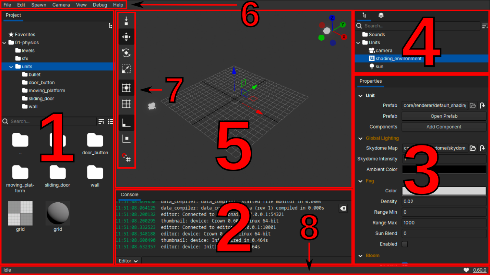

.. _level_editor:

===============
Editor overview
===============

Opening a :ref:`project` starts resource compilation automatically. After Crown
finishes compiling the resources, it launches the Level Editor, which should
look similar to the following image:



   The Level Editor interface in its default configuration.

The Level Editor interface consists of several panels:

====== ======================= =============
Number Name                    What it shows
====== ======================= =============
1      :ref:`Project Browser`  The current project's contents.
2      :ref:`Console`          Messages from the Level Editor, the Game and other Runtimes.
3      :ref:`Inspector`        The properties of the currently selected object.
4      :ref:`Level Tree`       A hierarchical view of all the objects in the Level.
5      :ref:`Level Viewport`   The Level being edited.
6      Menubar                 Common commands for editing / debugging / opening editors etc.
7      Toolbar                 Tools and common options for editing.
8      Statusbar               Contextual info and small self-contained messages.
9      Titlebar                Start/Stop Level button, current level name and edit status.
====== ======================= =============

Layout customization
====================

Most panels are optional and can be toggled from the ``View`` menu in the
Menubar.

Press ``Ctrl+``` to show or hide the Console. When the Console is visible, press
the same shortcut to move focus to the Command Bar.

Running the game
================

Press ``F5`` to play the currently edited level. Crown saves a copy of the
level you are editing and launches it in a separate window. When the level is
running, the Console automatically connects to the game's runtime and
switches to communicate with it.

To stop the playtest, close the game window or press the Stop Level button on
the Titlebar. If the runtime takes too long to stop, it will be forcibly
terminated. At exit the Console will switch back to communicating with the
editor's runtime.

To run the complete game, choose ``Debug -> Run Game`` from the Menubar. Crown
then launches the game as it would appear to an end user.
