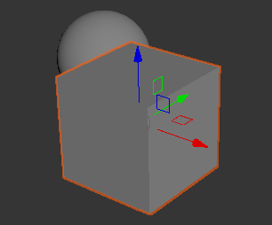
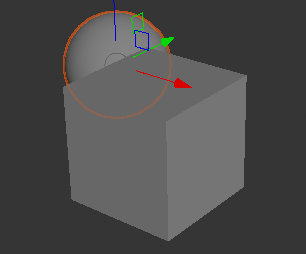
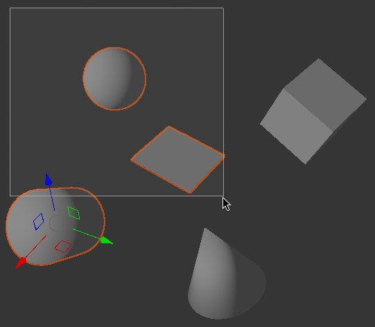

==============
Level Viewport
==============

This section describes how to navigate the Level Viewport so you can inspect,
edit, and compose scenes comfortably. The viewport supports both quick,
mouse-only navigation for casual inspection and more precise, keyboard-plus-
mouse controls for editing and layout work.

Basic mouse navigation
======================

If you only need a quick look around, the mouse provides simple and immediate
controls. Rolling the mouse wheel zooms the camera in and out. Clicking and
dragging the ``Middle Mouse Button`` orbits the view around the current
interest point. The orbit center typically coincides with the last framed
selection, so framing an object first (see the :ref:`Framing objects`
section) gives you a predictable pivot for orbiting.

Keyboard + mouse navigation
===========================

For more controlled camera adjustments, combine keyboard modifiers with mouse
actions.

* Hold ``Left Alt`` while dragging with the ``Left Mouse Button`` to rotate
  around the interest point;
* Hold ``Left Alt`` and drag with the ``Middle Mouse Button`` to pan the view
  horizontally and vertically;
* Hold ``Left Alt`` and drag with the ``Right Mouse Button`` to zoom in and
  out.

Flythrough navigation
=====================

When you need to traverse the level at speed, use flythrough mode. Hold the
``Right Mouse Button`` to control the camera orientation with the mouse, then
use the keyboard to move the camera as if you were playing a first-person
game:

* ``W`` / ``S`` to move forward and backward;
* ``A`` / ``D`` to strafe left and right;
* ``Q`` / ``E`` to move the camera up and down.

Flythrough mode is handy for scanning large environments, testing sightlines,
or checking level flow at player height.

Selecting objects
=================

Selecting objects is the primary way to focus edits and transformations on
specific objects in the scene. Left-click an object to select it; a dim
orange outline will be drawn around selected objects in the viewport:

   A selected cube highlighted in the Level Viewport.

If a selected object is occluded by unselected ones, Crown still highlights it
with a slightly dimmed orange outline so you can keep working with it even
when it is not fully visible:

   A selected sphere with dimmed highlighting where occluded.

To clear the current selection, just left-click an empty area or press
``Shift + Ctrl + A``.

Multiple selection
------------------

Hold ``Left Shift`` while left-clicking to add unselected objects to the
current selection. Conversely, left-click an already selected object to
remove it from the selection.

To select multiple objects by area, left-click and drag to draw a selection
rectangle; any object that intersects that rectangle will be selected.

   Box selection in the Level Viewport.

Framing objects
===============

Framing centers and zooms the camera on selected objects so you can work on
them with a consistent viewpoint.

Select one or more objects and press ``F`` to frame the current selection; the
camera will pan and zoom so the selected objects fill the viewport
comfortably. Press ``A`` to frame the entire scene.

Framing is especially useful before orbiting or when you want to set a stable
interest point for subsequent camera manipulations.

Placing objects
===============

Place content into the scene by entering place mode or by dragging units from
the Project Browser.

Press ``Q`` to enter place mode; the cursor then becomes a placement tool and
a chosen unit can be spawned with a mouse click. If no unit is selected for
spawning, clicks have no effect. At any time, press ``Esc`` to exit placing
mode: Crown will enter the tool that was active before entering place mode.

Dragging a Unit directly from the Project Browser into the Level Viewport
automatically selects the Spawn tool and sets the dragged unit as the current
spawn candidate.

Click the ``Left Mouse Button`` to place the unit. By default Crown raycasts
from the camera origin through the mouse cursor to determine the Z height
where the unit should be positioned. If you click and hold the ``Left Mouse
Button``, then move the mouse, Crown will place the unit at any XY location
on the horizontal plane defined by the height where you first clicked. This
lets you position objects precisely along a fixed elevation.

Moving, rotating, and scaling objects
=====================================

Transform objects with the standard ``W``, ``E``, and ``R`` keys to enter
Move, Rotate, and Scale modes respectively.

When one or more objects are selected, Crown displays a transform gizmo at the
origin of the selection. The gizmo provides axis handles, planar handles and
a camera-aligned handle. Interact with the gizmo using left-click and drag.

.. figure:: images/move_rotate_scale.png
   :align: center

   Move, rotate, and scale gizmos in the Level Viewport.

Move gizmo
----------

* Left-click and drag an axis handle to move the object along that axis.
* Drag the small red, green, or blue rectangles to move the object constrained
  to the XY, YZ, or ZX plane respectively.
* Drag the small gray circle at the gizmo origin to move the object on the
  plane parallel to the camera view.

Rotate gizmo
------------

* Drag any red, green, or blue arc to rotate the object around the X, Y, or Z
  axis.
* Drag the large gray circle to rotate the object around the axis that is
  perpendicular to the camera view plane.

Scale gizmo
-----------

* Drag an axis handle to scale the object along that axis.
* Drag the colored rectangles (for example red-green to scale on the XY plane)
  to scale across the respective plane.
* Drag the large gray circle to scale uniformly on all axes at once.

Local and World axis
--------------------

Normally, gizmo axes are aligned to the local coordinate system of the
selected object. That makes transforms intuitive when you want to move,
rotate, or scale an object relative to its own orientation. However, when an
object is rotated inconveniently, local axes can make it difficult to perform
edits that must align to the scene or the world origin.

Switching to the ``World Axis`` mode forces all gizmos to align to the world
coordinate system regardless of the selected object's local transformations.

Toggle axis mode using the Local/World Axis control in the toolbar:

.. figure:: images/local_world_axis.svg
   :align: center

   Toggling between local and world axis modes.

Snapping
========

By default Crown lets you position and rotate objects freely. When you require
precision, enable grid and angle snapping to constrain transforms to fixed
increments. Toggle snapping by clicking the ``Snap To Grid`` button on the
toolbar:

   The Snap To Grid control in the toolbar.

With snapping enabled, movement and rotation will snap to the configured grid
size and snap angle. Hold ``Left Ctrl`` while performing a transform to
temporarily disable snapping and make a single free adjustment.

Change the grid cell size or the snap angle with ``Ctrl+G`` and ``Ctrl+H``
respectively. These shortcuts open dialogs where you can type exact numeric
values for the grid spacing and angle increment:

.. figure:: images/grid_size_dialog.png
   :align: center

   Configuring grid size and snap angle.

Relative and Absolute snapping
------------------------------

Crown offers two snapping coordinate modes. In Relative Snapping mode the
snapping grid origin is aligned to the origin of the object being
transformed; this makes the grid move together with the object and is
convenient for local adjustments.

In Absolute Snapping mode the snapping grid is fixed at the world origin,
which is useful for aligning multiple objects to a common global grid.

Switch between the two modes using the ``Relative Snap`` and ``Absolute Snap``
toolbar buttons.

.. figure:: images/relative_absolute_snap.svg
   :align: center

   Relative and absolute snapping controls.
