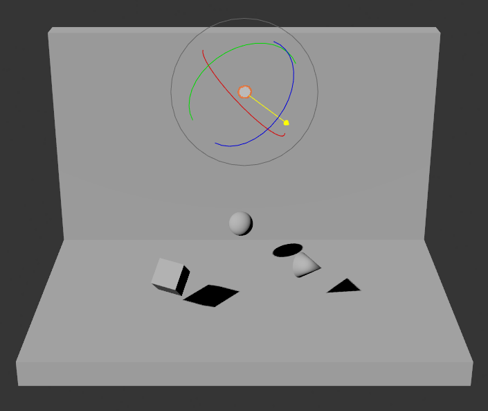
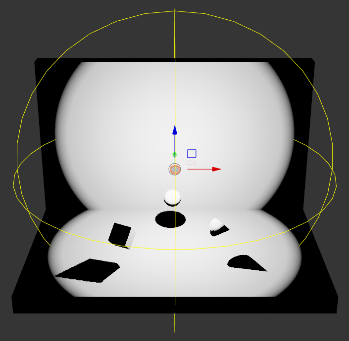
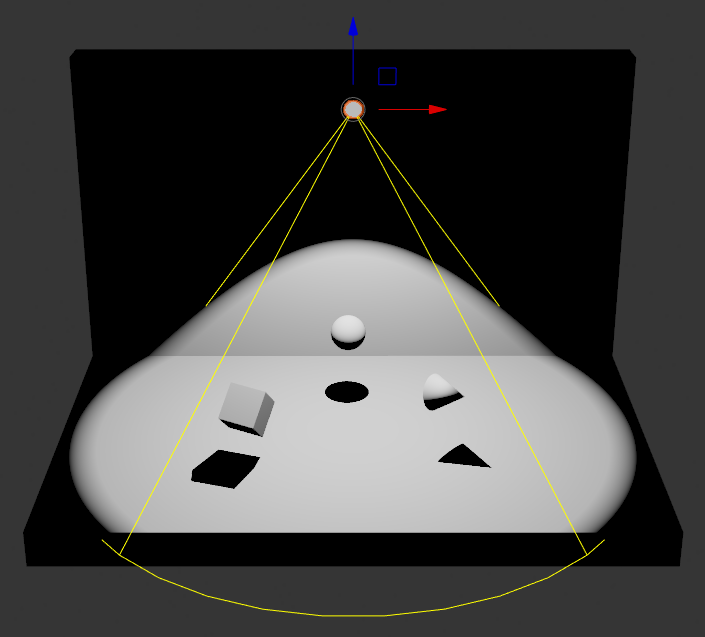
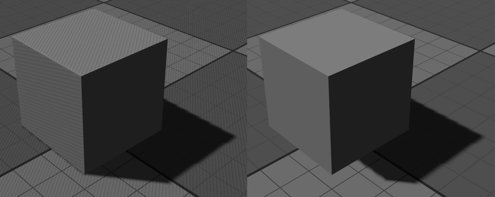

========
Lighting
========

Crown provides three light types: directional, omni, and spot. Lights are
regular :ref:`Units` with a Light Component attached; the component's
``Type`` property selects the light type. Add a light to the level using
``Spawn`` -> ``Light`` in the :ref:`Menubar <Editor overview>`.

Directional light
=================

A directional light illuminates objects from a uniform direction; The
brightest directional light in a Level (the one with the highest
``Intensity``) is considered the sun. The sun typically renders shadows for
the entire level using Cascaded Shadow Maps. Crown adds a default sun unit to
new levels created from the :ref:`Level Editor <level_editor>`.

   A directional light illuminating objects in the Level Viewport.

Local lights
============

Local lights affect only nearby objects. They expose a maximum range property
to limit their influence. Keep ranges reasonably small to reduce performance
cost and to avoid shadowing artifacts; very large ranges can make shadows and
lighting harder to tune.

Omni light
----------

Omni lights emit in all directions and are suitable for simulating point light
sources such as light bulbs, fireplaces and so on.

   An omni light illuminating objects in the Level Viewport.

Spot light
----------

Spot lights emit light inside a cone. Use the Light Component's ``Spot Angle``
and ``Range`` to shape the cone. Spot lights are appropriate for torches,
street lights and similar sources.

   A spot light illuminating objects in the Level Viewport.

Shadows
=======

Crown uses different shadow mapping approaches depending on the light type.
Directional light shadows are rendered with Cascaded Shadow Maps (4 splits).
Local lights combine tetrahedron mapping and regular shadow maps inside a
single shadow atlas. Use the :ref:`Render Config` to tune shadow-map
resolution and related parameters.

Rendering convincing shadows require careful tuning. Two common shadow mapping
artifacts are shadow acne and peter-panning. Use the Light Component's
``Shadow Bias`` property to reduce these issues.

The ``Shadow Bias`` offsets depth comparisons to compensate for shadow map
precision limits. Lower bias values reduce peter-panning but can expose
shadow acne; higher bias values reduce acne but can cause noticeable
separation between casting objects and their shadows (peter-panning). Adjust
bias incrementally to find the best compromise for your Level.

   Left: shadow acne (low bias). Right: peter-panning (high bias).

Skydome
=======

Crown automatically adds an implicit skydome Unit to every new Level created
with the :ref:`Level Editor <level_editor>`. It is rendered on the current
camera's far plane and is always centered to it, so it appears infinitely
distant and does not shift as the camera moves. Its texture and intensity are
configured via the :ref:`Shading Environment <Global Lighting>`.
