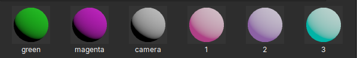

=========
Materials
=========

Materials in Crown are resources with the ``.material`` extension. They define
the shading (i.e. the visual appearance) of objects in the scene.

   Some materials displayed in the Project Browser.

At the technical level, a material binds a shader together with its options
and parameters (uniforms and samplers). For example, the built-in
``core/units/primitive`` material uses the shader named ``mesh`` and assigns
values appropriate to primitive objects to all uniforms that shader exposes.

Creating Materials
==================

Materials are normally created indirectly by the :ref:`importers
<importing_resources>` when you bring in external resources.

For instance:

* Importing a 3D scene automatically generates the required ``.material``
  resources
* Importing sprites also produces associated material resources

You can also create standalone materials directly in the :ref:`Level Editor
<level_editor>`:

1. Open the :ref:`Project Browser`
2. Right-click inside the target folder
3. Choose ``New Material...``
4. Give it a unique name and confirm

Assigning Materials to Units
============================

Materials are assigned to units through their rendering components. The ``Mesh
Renderer`` component for example exposes a ``Material`` property.

.. figure:: images/mesh_renderer_material.svg
   :align: center

   The Material selector in the Mesh Renderer component.

Click the folder icon next to the material's name to open the Material Chooser
and pick the desired material from the list.

You can also assign materials programmatically at runtime via
the :ref:`RenderWorld` Lua API.

Modifying Material properties
=============================

Once a material is assigned, you can modify its properties dynamically from
Lua scripts using the :ref:`Material` API.
