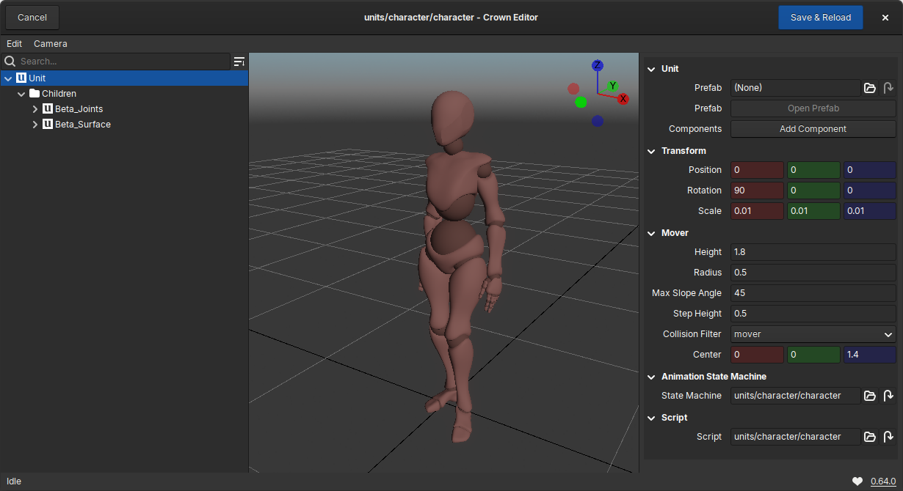

===========
Unit Editor
===========

The Unit Editor is a specialized editor dedicated to working with Unit prefabs
in isolation. It behaves similarly to the :ref:`Level Editor <level_editor>` but focuses on a
single Unit hierarchy at a time.

   The Unit Editor.

Editing Units in the Unit Editor
================================

To open a Unit in the Unit Editor:

- From the :ref:`Project Browser`, double‑click a ``.unit`` resource, or
- in the :ref:`Inspector`, click ``Open Prefab`` on a Unit that references a
  prefab.

